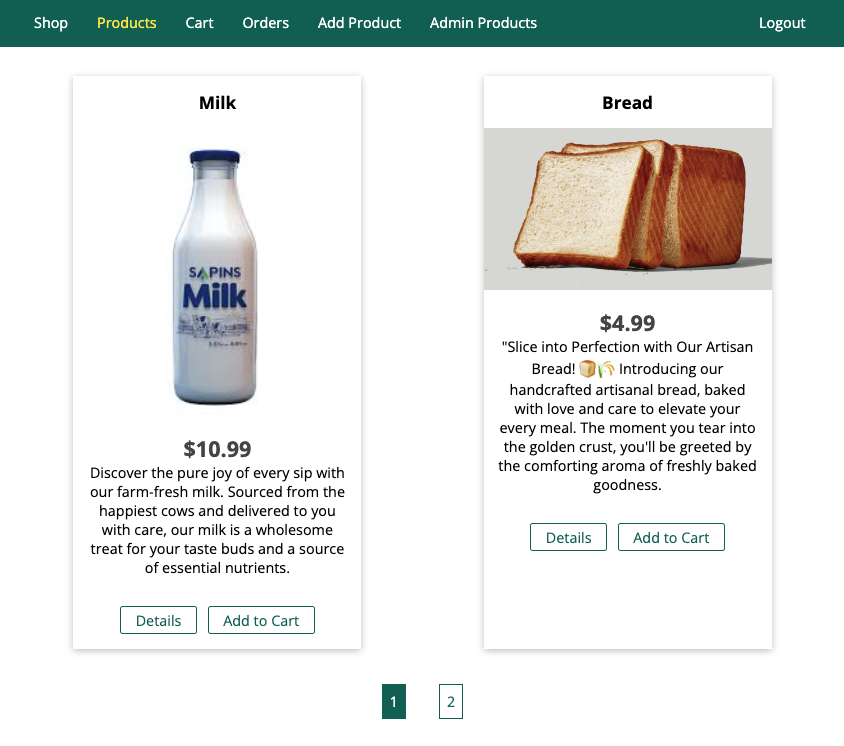
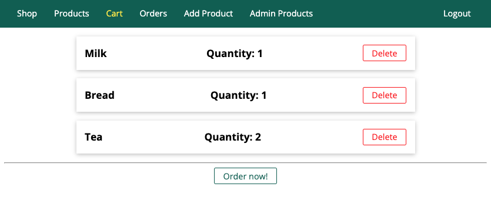
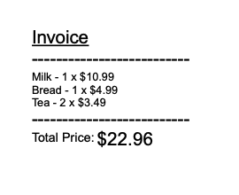
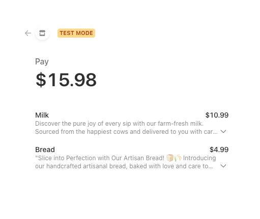
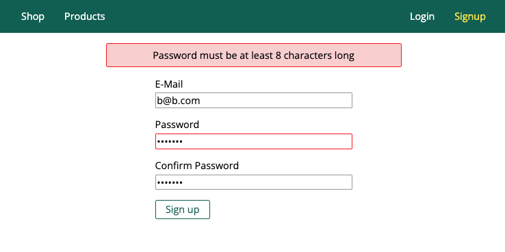

# ShopSavvy: Your Ultimate Retail Destination

This is a _Node-Express_ application that should look like a **shop** 🛍️.

## Technology stack

- uses `EJS templating engine` to render HTML pages
- uses `MVC pattern` for structuring the codebase
- has `MongoDB` as a main database
- to work effectively with mongoDB uses ODM `mongoose`
- has `authentication and data validation`
- uses `SendGrid` to send emails
- works with `sessions and cookies`
- has the ability to `reset a password` by sending an email
- makes use of `multer package to upload files`
- `protected against csrf` attacks
- has `pagination`
- `creates invoice PDFs` on the fly
- implements all of the `CRUD operations`
- to make a payment app is using a test version of the `Stripe API`

## Application Interface

### Product page



### Cart



### Generated invoice



### Stripe payment page



### Sing up page



## Getting started

To get the Node server running locally:

- Clone this repo
- `npm install` to install all required dependencies
- Set up environment variables
- Run `npm start` to start the server

## .env structure

```.env
MONGO_USER=
MONGO_PASSWORD=

EMAIL_API_KEY=
HOST=http://localhost:3000
SENDER_EMAIL=

STRIPE_PRIVATE_KEY=
```
